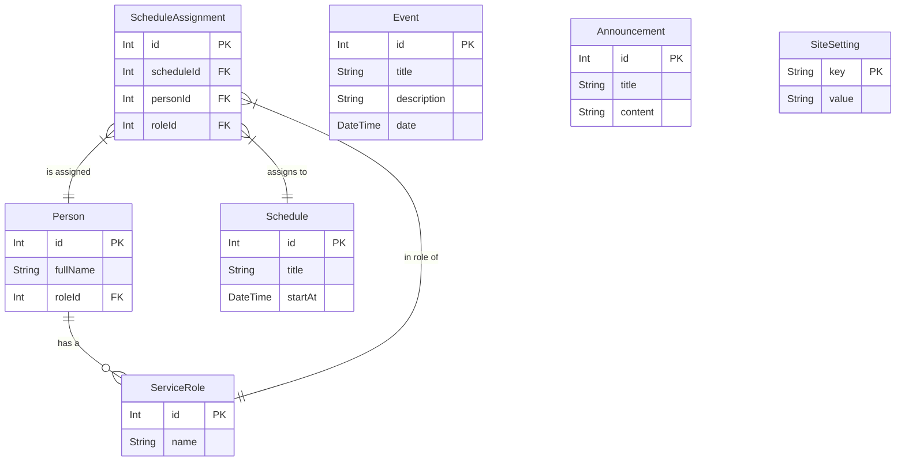

# Design Spec: Website Paroki Sandai

- **Tanggal**: 2026-06-25
- **Status**: Draft
- **Persetujuan**: Claude & User

## 1. Latar Belakang dan Tujuan

Website Paroki Sandai dibangun untuk menyediakan platform digital yang informatif bagi umat dan masyarakat umum. Tujuannya adalah untuk memusatkan informasi kegiatan paroki, jadwal pelayanan, serta mempermudah akses terhadap informasi penting lainnya. Fitur utama yang menjadi fokus adalah **Kalender Jadwal Pelayanan** yang dinamis dan mudah dikelola.

## 2. Arsitektur Keseluruhan

| Layer | Teknologi | Alasan |
| :--- | :--- | :--- |
| **Framework** | Next.js 16 (App Router) | Menggunakan fitur terbaru React (Server Components) untuk performa optimal. |
| **Frontend (Publik)** | Flowbite (React) | Menyediakan komponen UI siap pakai (Carousel, Card, Table) yang responsif dan sesuai dengan Tailwind CSS. |
| **Frontend (Admin)** | shadcn/ui (Radix) | Pustaka komponen yang aksesibel dan mudah dikustomisasi untuk kebutuhan dashboard internal. |
| **Database & Auth** | Supabase (PostgreSQL) | Solusi terintegrasi untuk otentikasi, basis data, dan penyimpanan file. |
| **ORM & Validasi** | Prisma & Zod | Prisma untuk interaksi basis data yang type-safe, Zod untuk validasi skema data dari frontend ke backend. |
| **API Layer** | Next.js Route Handlers | Menjaga semua logika akses data tetap berada dalam satu repositori proyek. |
| **Styling** | Tailwind CSS v4 | Sistem styling modern yang terintegrasi baik dengan Next.js, Flowbite, dan shadcn/ui. |

## 3. Desain Halaman Publik (Flowbite)

### 3.1. Halaman Utama (`/`)

Struktur halaman utama dirancang untuk memberikan gambaran lengkap tentang kegiatan paroki dalam satu tampilan.

| Urutan | Seksi | Komponen Flowbite | Sumber Data |
| :--- | :--- | :--- | :--- |
| 1 | **Header** | `Navbar` | Statis |
| 2 | **Slider/Carousel** | `Carousel` | Gambar dari Supabase Storage |
| 3 | **Jadwal Misa Cepat** | `Table` (Compact) | `GET /api/schedules/today` |
| 4 | **Cuplikan Kalender** | `Table` (Responsive) | `GET /api/schedules?limit=5` |
| 5 | **Kegiatan Mendatang** | `Card` Grid | `GET /api/events/upcoming?limit=5` |
| 6 | **Pengumuman Singkat** | `List` & `Badge` | `GET /api/announcements?limit=4` |
| 7 | **Sambutan Pastor** | `Blockquote` & `Avatar` | Data dari `SiteSetting` |
| 8 | **Footer** | `Footer` | Statis & `SiteSetting` |

### 3.2. Halaman Publik Lainnya

| Rute | Halaman | Tujuan | Komponen Utama Flowbite |
| :--- | :--- | :--- | :--- |
| `/jadwal` | Kalender Pelayanan | Tampilan kalender penuh (bulanan/mingguan). | `Table`, `Pagination`, `Datepicker` |
| `/profil` | Profil Paroki | Sejarah, visi-misi, daftar romo, pengurus. | `Accordion`, `Card` |
| `/sakramen` | Informasi Sakramen | Panduan dan syarat untuk Baptis, Komuni, dll. | `List`, `Tabs` |
| `/hubungi` | Kontak | Alamat, peta interaktif, form kontak. | `Form`, Google Maps `iframe` |
| `/pengumuman` | Arsip Pengumuman | Daftar semua pengumuman yang pernah dibuat. | `Card` List, `Pagination` |
| `/kegiatan` | Arsip Kegiatan | Daftar semua kegiatan mendatang/lalu. | `Card` List, `Pagination` |

## 4. Desain Dashboard Admin (shadcn/ui)

Dashboard admin dirancang untuk fungsionalitas dan efisiensi dalam pengelolaan data.

- **Layout**: Semua halaman admin akan menggunakan layout terproteksi (`/dashboard/layout.tsx`) yang memeriksa sesi otentikasi Supabase.
- **Navigasi**: Sidebar untuk navigasi antar modul (Jadwal, Petugas, Kegiatan, dll).
- **Interaksi**: Operasi `CREATE` dan `UPDATE` akan menggunakan komponen `Dialog` (modal) untuk menjaga user tetap di halaman utama modul. Operasi `DELETE` akan menggunakan `AlertDialog` untuk konfirmasi.

| Rute | Modul | Deskripsi | Komponen Utama shadcn/ui |
| :--- | :--- | :--- | :--- |
| `/dashboard/login` | Login | Halaman login untuk admin. | `Form`, `Input`, `Button`, `Card` |
| `/dashboard` | Beranda Admin | Ringkasan data (misal: jumlah jadwal bulan ini). | `Card`, `Badge` |
| `/dashboard/schedules` | Manajemen Jadwal | CRUD untuk jadwal pelayanan dan penugasan petugas. | `DataTable`, `Dialog`, `Select`, `Calendar` |
| `/dashboard/persons` | Manajemen Petugas | CRUD untuk data petugas (Romo, Lektor, dll). | `DataTable`, `Dialog`, `Input` |
| `/dashboard/roles` | Manajemen Peran | CRUD untuk peran pelayanan (e.g., "Prodiakon"). | `DataTable`, `Dialog`, `Input` |
| `/dashboard/events` | Manajemen Kegiatan | CRUD untuk "Kegiatan Mendatang". | `DataTable`, `Dialog`, `Textarea` |
| `/dashboard/announcements` | Manajemen Pengumuman | CRUD untuk pengumuman singkat. | `DataTable`, `Dialog`, `Textarea` |
| `/dashboard/settings` | Pengaturan Situs | Mengelola info kontak, sosmed, sambutan pastor. | `Form`, `Input`, `Tabs` |

## 5. Desain Basis Data & Skema

Menggunakan **Pendekatan Relasional Penuh** untuk integritas data.

### 5.1. Diagram Relasi Entitas (ERD)



### 5.2. Skema Prisma (`schema.prisma`)

```prisma
// Catatan: datasource db dan generator client dikonfigurasi di prisma/schema.prisma
// setelah Supabase credentials tersedia di environment.

model ServiceRole {
  id          Int                  @id @default(autoincrement())
  name        String               @unique
  description String?
  persons     Person[]
  assignments ScheduleAssignment[]
}

model Person {
  id          Int                  @id @default(autoincrement())
  fullName    String
  email       String?              @unique
  roleId      Int?
  role        ServiceRole?         @relation(fields: [roleId], references: [id])
  assignments ScheduleAssignment[]
}

model Schedule {
  id          Int                  @id @default(autoincrement())
  title       String
  startAt     DateTime
  endAt       DateTime
  location    String               @default("Gereja Paroki")
  description String?
  assignments ScheduleAssignment[]
}

model ScheduleAssignment {
  id         Int         @id @default(autoincrement())
  scheduleId Int
  personId   Int?
  roleId     Int
  schedule   Schedule    @relation(fields: [scheduleId], references: [id], onDelete: Cascade)
  person     Person?     @relation(fields: [personId], references: [id], onDelete: SetNull)
  role       ServiceRole @relation(fields: [roleId], references: [id])
}

model Event {
  id          Int      @id @default(autoincrement())
  title       String
  description String?
  date        DateTime
  imageUrl    String?
}

model Announcement {
  id        Int      @id @default(autoincrement())
  title     String
  content   String
  createdAt DateTime @default(now())
}

model SiteSetting {
  key   String @id
  value String
}
```

### 5.3. Skema Validasi Zod (`schemas/`)

Untuk setiap model Prisma, akan dibuatkan skema Zod yang sesuai untuk validasi `CREATE` dan `UPDATE` pada Server Actions. Contoh untuk `Schedule`:

```typescript
// schemas/schedule.schema.ts
import * as z from 'zod';

export const ScheduleSchema = z.object({
  title: z.string().min(3, "Judul minimal 3 karakter"),
  startAt: z.date({ required_error: "Tanggal mulai harus diisi" }),
  endAt: z.date({ required_error: "Tanggal selesai harus diisi" }),
  location: z.string().optional(),
  description: z.string().optional(),
  assignments: z.array(z.object({
    roleId: z.number(),
    personId: z.number().optional()
  })).optional()
});
```

## 6. Struktur Kode & Pola

Mengikuti struktur yang telah didefinisikan dalam `CLAUDE.md`, dengan pemisahan yang jelas antara:

- `app/`: Routing dan UI.
- `actions/`: Logika mutasi data (Server Actions).
- `services/`: Logika pengambilan data (Read-only queries).
- `components/`: Komponen UI yang dapat digunakan kembali.
- `lib/`: Inisialisasi klien (Prisma, Supabase).
- `schemas/`: Definisi skema validasi Zod.
- `prisma/`: Skema dan migrasi basis data.

## 7. Rencana Verifikasi dan Pengujian

- **Linting & Type-Checking**: `npm run lint` akan dijalankan secara berkala.
- **Pengujian Manual**:
  - Alur admin: Login -> Buat Petugas -> Buat Jadwal -> Tugaskan Petugas -> Verifikasi di halaman publik.
  - Alur publik: Akses semua halaman, pastikan data tampil benar dan layout tidak rusak di berbagai ukuran layar.
- **Pengujian Otomatis (Jika Waktu Memungkinkan)**:
  - **Unit Test (Vitest)**: Untuk fungsi utilitas dan validasi skema Zod.
  - **E2E Test (Playwright)**: Untuk alur kritis seperti login admin dan pembuatan jadwal.

## 8. Langkah Berikutnya

Setelah dokumen ini disetujui, langkah selanjutnya adalah:

1. Membuat *Implementation Plan* yang memecah pekerjaan menjadi tugas-tugas teknis yang lebih kecil.
2. Memulai pengembangan sesuai fase yang telah ditentukan di `CLAUDE.md`.
